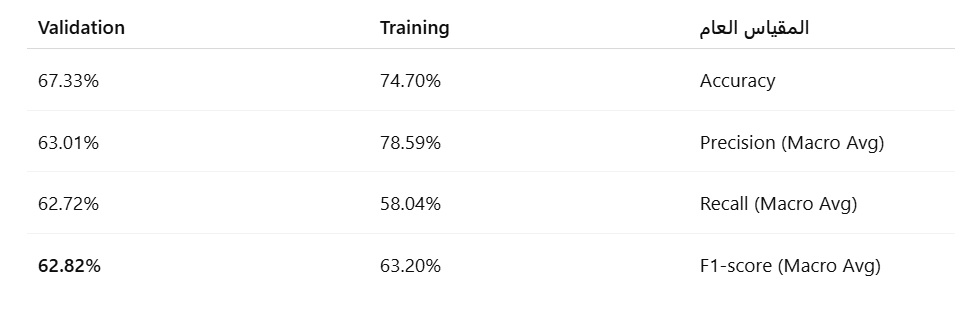

# ISIC 2017 Skin Lesion Classification with VGG16 Fine-Tuning

## Project Description

This project implements a skin lesion classification model for the ISIC 2017 dataset using a fine-tuned VGG16 architecture. The primary goal is to classify dermoscopic images into three categories for early detection of skin cancer. The dataset is loaded directly from Hugging Face, and the model employs advanced data augmentation and custom evaluation callbacks to monitor performance during training.

## Files Included

- **model_code.py**  
  Contains the full pipeline for:
  - Loading ISIC 2017 dataset from Hugging Face.
  - Custom image generator with on-the-fly augmentation.
  - Fine-tuning a pre-trained VGG16 model.
  - Custom callback for calculating Precision, Recall, and F1-score during training.
  - Training and evaluation process.

- **results.png**  
  Contains a visual summary of the training and validation performance metrics across epochs.

- **Performance Table**  
  Captured snapshot of final training and validation metrics (Accuracy, Precision, Recall, F1-score).

## Project Workflow & Architecture

The project follows this workflow:

1. **Data Loading**  
   The ISIC 2017 dataset is fetched via Hugging Face using `datasets.load_dataset`.

2. **Custom Data Generator**  
   A custom `FlexibleHFImageGenerator` class prepares the images with optional on-the-fly augmentation, resizing, and standard scaling. Supports three modes: `none`, `augment`, `double`.

3. **Model Architecture**  
   - Base Model: Pre-trained VGG16 (ImageNet weights) with top layers removed.
   - Trainable layers: Final layers of VGG16 are unfrozen for fine-tuning.
   - Custom Dense Head:
     - Flatten layer.
     - Dense layer with 256 units and ReLU activation.
     - Dropout layer for regularization.
     - Final Dense layer with 3 units and softmax activation for classification.

4. **Training Setup**  
   - Optimizer: Adam with a learning rate of 1e-4.
   - Loss: Sparse categorical crossentropy.
   - Metrics: Accuracy.
   - Callbacks:
     - EarlyStopping to prevent overfitting.
     - ReduceLROnPlateau for adaptive learning rate adjustment.
     - Custom callback for real-time Precision, Recall, and F1-score calculation.

5. **Training & Evaluation**  
   The model is trained on the augmented training set and validated on the clean validation set.

## Results

### Performance Summary

| Metric                 | Training | Validation |
|-----------------------|----------|-------------|
| **Accuracy**           | 74.70%   | 67.33%      |
| **Precision (Macro Avg)** | 78.59%   | 63.01%      |
| **Recall (Macro Avg)**    | 58.04%   | 62.72%      |
| **F1-score (Macro Avg)**  | 63.20%   | **62.82%**  |

### Visual Results

Additional details and the trained model can be accessed on [Hugging Face](https://huggingface.co/saada2024/isic-2017).

## Project Limitations

- The model exhibits a noticeable drop in performance from training to validation, indicating mild overfitting.
- Limited dataset size can constrain generalization.
- Class imbalance in the dataset may affect macro-averaged metrics.
- Further hyperparameter tuning could improve stability.

## Suggested Project Name

**ISIC-2017 Lesion Classifier: VGG16 Fine-Tuned Approach**

## Future Improvements

- Experiment with other architectures like EfficientNet or MobileNet for better performance and efficiency.
- Incorporate additional data augmentation techniques to enhance robustness.
- Address class imbalance using weighted loss functions or oversampling.
- Apply advanced regularization methods to reduce overfitting.
- Perform hyperparameter optimization using tools like Optuna.
- Explore ensembling multiple models to improve final predictions.

---

`Documented by [M.A.Saada]`
